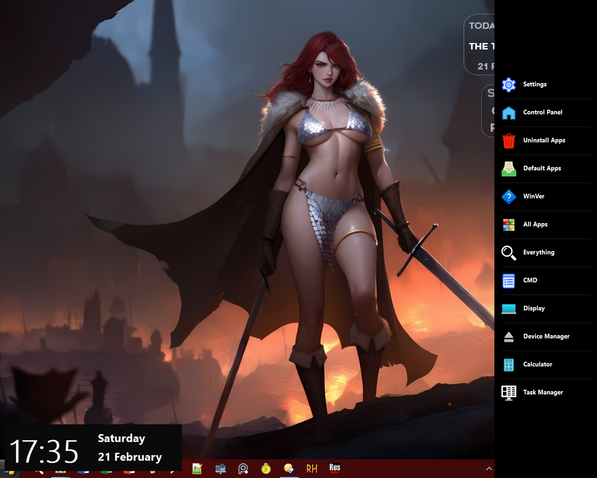
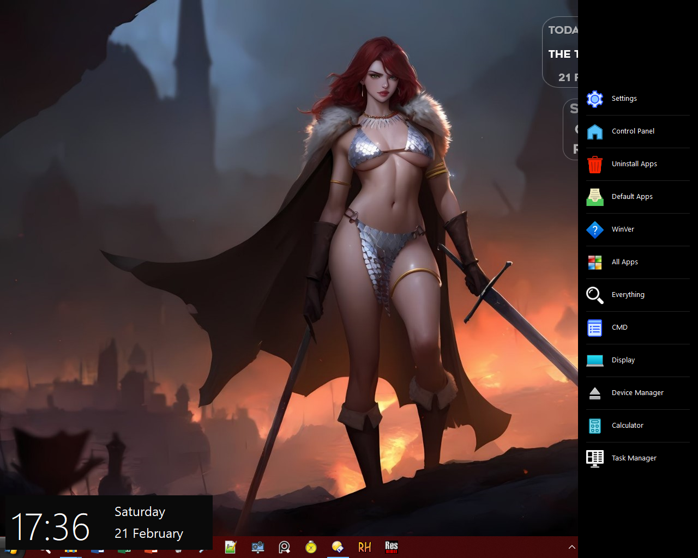
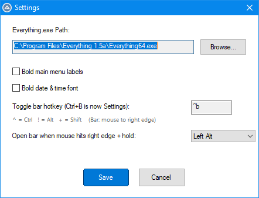

___

## 🪟 Windows 8.1 Side Launch Bar

A sleek, customizable sidebar launcher for Windows that provides quick access to system tools, settings, and applications with a modern Windows 8.1 inspired design.

___


## 🌞🎁 ALL FEATURES 🎁🌞

___


## 📌 Font Bold





___


## 📌 Font Normal





___


## 🌿Setting





___

## ✨ Features

- Edge-Activated Sidebar – Automatically appears when mouse hits the right screen edge  
- Customizable Hotkeys – Set your preferred keyboard shortcuts for toggling  
- Modifier Key Support – Require Alt/Ctrl/Shift + edge hover to open  
- Quick System Access – One-click launch to Windows settings, control panel, and system tools  
- Integrated Date/Time – Beautifully formatted clock and calendar display  
- AMOLED Black Theme – Pure black background perfect for OLED screens  
- Portable – No installation required, runs from a single folder  

---

## 📥 Installation Options

All versions are portable – no installation needed! Just download, extract, and run.

Complete Packages (Recommended)

| Package | Contents | Instructions |
|---------|----------|--------------|
| Win8_Side_Bar_Alpha_Source_Code.zip | Win8_Side_Bar_Alpha.au3 + icons/ folder | Extract everything to a folder. Open/edit the .au3 file with AutoIt if you want to modify the code. |
| Win8_Side_Bar_Alpha_x64.zip | Win8_Side_Bar_Alpha_x64.exe + icons/ folder | Extract both the .exe and the icons/ folder to the same location. Run the .exe to start. |
| Win8_Side_Bar_Alpha_x86.zip | Win8_Side_Bar_Alpha_x64.exe + icons/ folder | Extract both the .exe and the icons/ folder to the same location. Run the .exe to start. |

⚠️ Important: The icons/ folder must be in the same directory as the .exe file, otherwise the menu icons won't display!

---

Separate Files (Manual Setup)

- Win8_Side_Bar_Alpha_x64.exe – 64-bit executable  
  - Create a folder, place this .exe inside  
  - Download icons.zip and extract its contents into an icons/ folder next to the .exe  

- Win8_Side_Bar_Alpha_x86.exe – 32-bit executable  
  - Same as above – needs icons/ folder in the same directory  

- Win8_Side_Bar_Alpha.au3 – AutoIt source script  
  - Place this in a folder with the icons/ folder (extracted from icons.zip) to run/edit the script  

- icons.zip – Icon pack  
  - Extract to get an icons/ folder containing A1.ico through A12.ico  

Example folder structure after manual setup:

```
Your_Folder/
├── Win8_Side_Bar_Alpha_x64.exe     (or the .au3 script)
├── icons/
│   ├── A1.ico
│   ├── A2.ico
│   └── ... (up to A12.ico)
```

---

## 🎯 Menu Items

| Item | Action |
|------|--------|
| Settings | Opens Windows Settings |
| Control Panel | Launches classic Control Panel |
| Uninstall Apps | Opens Apps & Features |
| Default Apps | Manages default applications |
| WinVer | Shows Windows version |
| All Apps | Simulates Windows key press |
| Everything | Launches Everything search (configurable path) |
| CMD | Command Prompt (Shift+Click for admin) |
| Display | Opens Display Settings |
| Device Manager | Launches Device Manager |
| Calculator | Opens Windows Calculator |
| Task Manager | Launches Task Manager |

---

## ⚙️ Configuration

Settings are saved in launchbar.ini and include:

- Everything.exe Path – Custom path to Everything search utility  
- Font Weight – Toggle bold text for menu labels and date/time  
- Toggle Hotkey – Custom keyboard shortcut (default: ^b for Ctrl+B)  
- Activation Modifier – Choose between Alt/Ctrl/Shift or no modifier for edge activation  

---

## 🎨 Visual Design

- AMOLED Black Background – Pure black (#000000) for the main bar  
- Dark Theme – Near-black (#0A0A0A) for the date/time panel  
- White Text – High contrast for readability  
- Segoe UI Font – Matches Windows 8.1 aesthetic  
- Subtle Separators – Minimalist design with almost invisible dividers  

___


## 📽️ Quick Overview


___

## ⌨️ Hotkeys

| Hotkey | Action |
|--------|--------|
| Ctrl+B | Open Settings dialog |
| Custom | Toggle bar (configurable) |

---

## 📁 File Structure After Installation

```
Your_Chosen_Folder/
├── Win8_Side_Bar_Alpha.au3 OR Win8_Side_Bar_Alpha_x64.exe OR Win8_Side_Bar_Alpha_x64.exe
├── icons/                          (MUST be present!)
│   ├── A1.ico through A12.ico
├── launchbar.ini                    (auto-created after first run)
```
---

## 🔧 Requirements

- Windows 7/8/8.1/10/11  
- AutoIt v3 (only if using the source .au3 file)  
- No additional dependencies or installations  

---

## 📝 Important Notes

- The bar stays on top of other windows when visible  
- Clicking outside the bar automatically hides it  
- Date/time updates every 5 seconds when visible  
- The "All Apps" item simply opens the Start screen/menu  
- CMD can be launched as administrator by holding Shift while clicking  
- First run will create launchbar.ini automatically in the same folder  
- The icons MUST be in an icons/ folder next to the executable/script!  

---

## 📄 License

Open-source for non-commercial use only.  
Feel free to modify and share, but please don't use this software for commercial purposes without permission.

🙂 Happy launching!

___

Made with ♥️ by AndrianAngel

___
